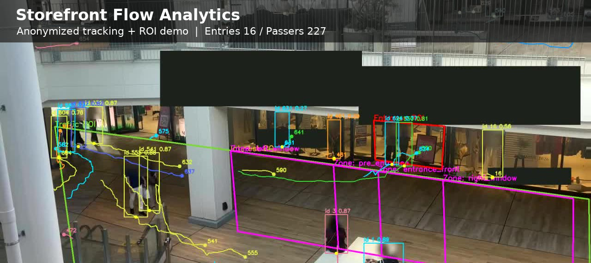

# Mall Storefront Behavior Analytics

English | [日本語](#日本語)

Anonymous behavior analytics for storefront videos.

The app analyzes pedestrian flow around a storefront using manually configured ROIs, person detection, tracking, and aggregate behavior metrics. It can generate bilingual EN/JP reports with storefront-name masks and face-region blurring.



## Demo Results

| Metric | Result |
|---|---:|
| Passers | 227 |
| Facade exposures | 86 |
| Entries | 16 |
| Entry rate | 7.0% |
| Entry rate 95% credible interval | 4.4% - 11.1% |
| Exposure rate | 37.9% |
| Exposure rate 95% credible interval | 31.8% - 44.4% |

View the full bilingual report:

- GitHub Pages: https://k3ijo-miyamoto.github.io/storefront-flow-analytics/
- Local file: open `docs/index.html` in a browser
- Debug video file: `docs/figures/store_a_behavior_debug_h264.mp4`

GitHub's repository README shows this preview image and summary table directly on the repository top page. The full HTML report and embedded video are best viewed through GitHub Pages or by opening the local HTML file.

## Summary Observations

The sample shows `227` observed passers in the configured Traffic ROI, `86` facade exposures, and `16` entries. The observed entry rate is therefore `16 / 227 = 7.0%`. With a Beta-Binomial model, the posterior mean is `7.4%` and the 95% credible interval is `4.4% - 11.1%`. This range is more useful than the point estimate alone: in a short clip, the underlying entry tendency should be read as a band of plausible values rather than a fixed number.

The observed exposure rate is `86 / 227 = 37.9%`. The posterior mean is `38.0%` and the 95% credible interval is `31.8% - 44.4%`. In this sample, a substantial minority of passers entered the storefront contact area, but most passers still continued through the traffic area without measurable facade contact. This makes the ROI definition important: widening the Traffic ROI increases the denominator and makes the rate more conservative.

The facade-zone matrix is best read as a path-analysis aid, not a causal attribution model. The entrance-adjacent zone naturally dominates last-touch signals because customers must pass near the entrance to enter. The more interesting signal is upstream first-touch: window zones away from the entrance can still become the first recorded facade contact before an eventual entry. That suggests the facade may work as a distributed attention surface, while the entrance area acts as the final conversion point.

The strongest practical takeaway is methodological. A single, short, handheld storefront clip can produce a useful diagnostic workflow: define traffic/contact/entrance regions, stabilize the footage, track people, inspect entry events, quantify uncertainty, and review facade-zone paths. The result should not be used as a definitive store performance evaluation. It is better framed as an anonymized analytics demo and a hypothesis generator for longer, better-controlled observation.

## Public Artifact

The shareable anonymized sample is in:

```text
docs/index.html
```

Open this HTML file in a browser to view the full results.

Debug video:

```text
docs/figures/store_a_behavior_debug_h264.mp4
```

GitHub Markdown may not reliably play local MP4 files inline. Use `docs/index.html` for the browser-viewable report with the embedded debug video, or open the MP4 file directly.

It includes:

- Aggregate storefront metrics
- Beta-Binomial uncertainty summaries
- Facade-zone analysis
- An anonymized debug video with storefront-name masks and face-region blurring
- Metric definitions in English and Japanese

The repository intentionally excludes raw videos, unmasked outputs, and store-name-bearing intermediate files through `.gitignore`.

## Development

Install the package in editable mode, then run tests:

```bash
pip install -e .
pytest -q
```

Analyze a video with an anonymized config:

```bash
env PYTHONPATH=src python -m mallflow.cli analyze \
  --config configs/store_a.yaml \
  --sample-fps 10 \
  --detector yolo \
  --tracker bytetrack \
  --output-dir outputs/store_a
```

Create a report:

```bash
env PYTHONPATH=src python -m mallflow.cli report \
  --metrics outputs/store_a/metrics/store_a_metrics.yaml \
  --tracks outputs/store_a/tracks/store_a_tracks.csv \
  --display-name "Store A" \
  --output outputs/reports/store_a_report.html
```

Create or update ROI annotations:

```bash
env PYTHONPATH=src python -m mallflow.cli annotate \
  --video data/raw/store_a.mp4 \
  --store STORE_A \
  --output configs/store_a.yaml \
  --display-width 1400 \
  --time 60
```

Annotation controls:

- Click polygon points for `Traffic ROI`, then press Space or Enter.
- Click polygon points for `Interest ROI`, then press Space or Enter.
- Click polygon points for `Entrance ROI`, then press `S` to save.
- Use `U` or Backspace to undo the current step.
- Use `Q` or Esc to cancel.
- Use `+` and `-` to resize the annotation window.

## 日本語

店頭動画を対象にした、匿名化前提の行動分析ツールです。

手動で設定したROI、人物検出、トラッキング、集計メトリクスを使って、店舗前の歩行者動線を分析します。店舗名マスクと顔付近ぼかしを含む、匿名化済み動画付きの日英切替レポートも生成できます。

## デモ結果

| 指標 | 結果 |
|---|---:|
| 通行者 | 227 |
| ファサード接触 | 86 |
| 入店 | 16 |
| 入店率 | 7.0% |
| 入店率 95%信用区間 | 4.4% - 11.1% |
| 接触率 | 37.9% |
| 接触率 95%信用区間 | 31.8% - 44.4% |

詳細な日英切替レポートを見る方法:

- GitHub Pages: https://k3ijo-miyamoto.github.io/storefront-flow-analytics/
- ローカルファイル: `docs/index.html` をブラウザで開く
- デバッグ動画ファイル: `docs/figures/store_a_behavior_debug_h264.mp4`

GitHubのリポジトリトップページでは、このREADMEのプレビュー画像とサマリーテーブルが直接表示されます。HTMLレポートと埋め込み動画は、GitHub PagesまたはローカルHTMLで見るのが確実です。

## 所見

このサンプルでは、Traffic ROI内の観測通行者が `227`、ファサード接触が `86`、入店が `16` でした。したがって観測された入店率は `16 / 227 = 7.0%` です。Beta-Binomialモデルでは、事後平均は `7.4%`、95%信用区間は `4.4% - 11.1%` です。短い動画では一点の率だけを見るより、「真の入店傾向はこの程度の幅であり得る」と読むほうが自然です。

観測された接触率は `86 / 227 = 37.9%` です。事後平均は `38.0%`、95%信用区間は `31.8% - 44.4%` です。このサンプルでは、通行者の一定割合が店頭接触領域に入っていますが、多くの人はTraffic ROIを通過するだけで、ファサード接触までは至っていません。そのため、Traffic ROIをどこまで広く取るかが結果に大きく影響します。今回の定義は分母を広めに取っているため、率はやや保守的に出ます。

ファサード分割は、売場・ウィンドウの効果を断定するものではなく、入店前の経路を読むための補助線として見るのが適切です。入口近傍領域のlast-touchが強く出るのは、入店者が入口前を通る以上、定義上かなり自然です。むしろ見る価値があるのは、入口から離れたウィンドウ領域が入店者の初回接触点になっている点です。これは、ファサード全体が注意を拾い、最終的に入口周辺で回収する、という仮説につながります。

この分析で一番意味があるのは、特定店舗の良し悪しを評価することではなく、店頭行動分析のワークフローが成立することを示せた点です。ROIを定義し、手ブレを補正し、人物を追跡し、入店イベントを目視確認し、統計的不確実性を付け、ファサード別の接触経路を見る。この一連の流れは、より長時間・複数日・固定カメラの観測に拡張すれば、店舗設計やファサード改善の仮説検証に使える可能性があります。

## 公開用アーティファクト

共有用の匿名化済みサンプルは以下にあります。

```text
docs/index.html
```

分析結果の本体は、このHTMLをブラウザで開くと確認できます。

デバッグ動画:

```text
docs/figures/store_a_behavior_debug_h264.mp4
```

GitHubのMarkdownでは、ローカルMP4がREADME内で安定してインライン再生されるとは限りません。デバッグ動画込みで見る場合は `docs/index.html` をブラウザで開くか、MP4ファイルを直接開いてください。

含まれるもの:

- 店頭集計メトリクス
- Beta-Binomialによる不確実性の要約
- ファサード分割分析
- 店舗名マスクと顔付近ぼかしを含む匿名化デバッグ動画
- 英語・日本語のメトリクス定義

raw動画、未マスク出力、店舗名を含む中間ファイルは `.gitignore` で除外しています。

## 開発

編集可能モードでインストールし、テストを実行します。

```bash
pip install -e .
pytest -q
```

匿名化された設定で動画を分析します。

```bash
env PYTHONPATH=src python -m mallflow.cli analyze \
  --config configs/store_a.yaml \
  --sample-fps 10 \
  --detector yolo \
  --tracker bytetrack \
  --output-dir outputs/store_a
```

レポートを作成します。

```bash
env PYTHONPATH=src python -m mallflow.cli report \
  --metrics outputs/store_a/metrics/store_a_metrics.yaml \
  --tracks outputs/store_a/tracks/store_a_tracks.csv \
  --display-name "Store A" \
  --output outputs/reports/store_a_report.html
```

ROIアノテーションを作成・更新します。

```bash
env PYTHONPATH=src python -m mallflow.cli annotate \
  --video data/raw/store_a.mp4 \
  --store STORE_A \
  --output configs/store_a.yaml \
  --display-width 1400 \
  --time 60
```

アノテーション操作:

- `Traffic ROI` の多角形点をクリックし、SpaceまたはEnterを押します。
- `Interest ROI` の多角形点をクリックし、SpaceまたはEnterを押します。
- `Entrance ROI` の多角形点をクリックし、`S` で保存します。
- `U` またはBackspaceで現在のステップを戻します。
- `Q` またはEscでキャンセルします。
- `+` と `-` で表示サイズを調整します。
